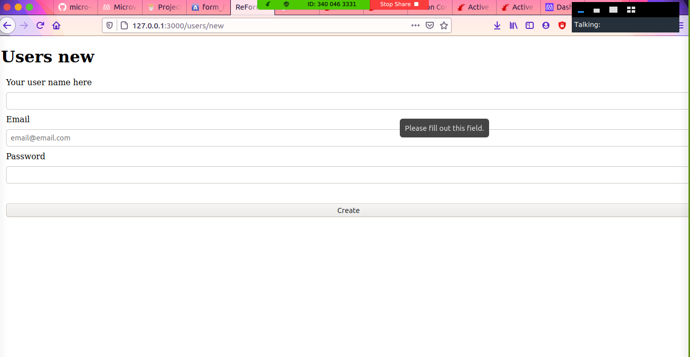

# Forms re-former

> In this project, we created different versions of forms using various methods like form_tag, form_for and vanilla HTML form in the views file, both for creating a new form and updating an existing form. 
> To achieve this, we generated a user model and a users controller with the sqlite3 being used for storage. 
> All the form fields have the necessary validations required to check the user input.

## Built with
- Ruby
- Rails
- Rubocop
- Sqlite3

## Getting started

You'll need to have both Ruby and Rails installed on your computer.

- In the desired directory, type `git clone https://github.com/mke2111/re-former.git` in the terminal.

- Then type `cd re-former` in the terminal to change the directory into the root of the project.

- Then type `bundle install && yarn install` to download the necessary gem files for the project.

- Run `rails server` to start the server for the application.

- Open `localhost:3000/users/new` to start filling in the form and create a new user.

- Open `localhost:3000/users/id/edit` to update an existing users' information. Remember to replace the `id` in the url with user id number such as `localhost:3000/users/2/edit`.

# Authors

## Author 1
👤**Marcelo Araújo**

- GitHub: [@marcelomaidden](https://github.com/marcelomaidden)
- Twitter: [@marcelomaidden](https://twitter.com/marcelomaidden)
- LinkedIn: [Marcelo Fernandes de Araújo](https://www.linkedin.com/in/marcelo-fernandes-de-ara%C3%BAjo-56700a171/)

## Author 2
👤**Roy Mukuye**
- GitHub: [@mke2111](https://github.com/mke2111)
- Twitter: [@Roymkenya](https://twitter.com/Roymkenya)
- LinkedIn: [Roy Mukuye](https://www.linkedin.com/in/roy-mukuye-42b07b1b4)

## 🤝 contributing

Contributions, issues, and feature requests are welcome!

Feel free to check the [issues page](https://github.com/mke2111/re-former/issues).

## show-your-support

Give a ⭐️ if you like this project!